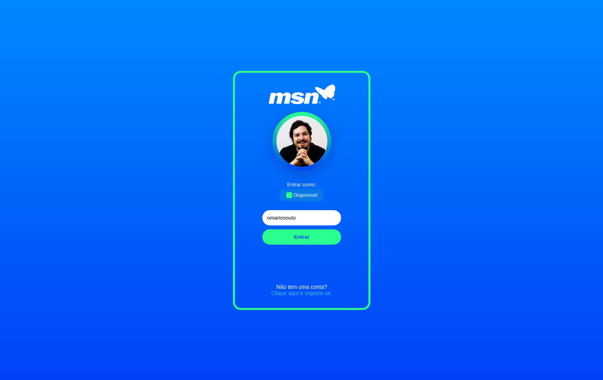

# MSN Redesign 🏳

Made with Next - Layout by Igor Monteiro | [Behance](https://www.behance.net/gallery/97236521/MSN-2020-Redesign?tracking_source=search_users_recommended)

<p align="center">
  <a></a>
</p>

<p align="center">
  <a></a>
</p>

## 🛠️ Stack

- Next
- React
- Yarn (v1.22.17)
- CSS in JS
- CSS - Gradient
- Responsive website
- Flexbox

## Run

First of all, we must clone the repository:

```
  $ git clone git@github.com:laisfrigerio/msn-redesign.git
```

Or case if it is a fork:

```
  $ git clone https://github.com/<your_username>/msn-redesign.git
```

And get into folder:

```
  $ cd msn-redesign
```

Then, install dependencies

```
  $ yarn install
  $ yarn dev
```

## :woman: Author

| [<br /><sub><b>@laisfrigerio</b></sub>](https://github.com/laisfrigerio)<br /> |
| :---: |

## 📄 License

This project is licensed under the MIT License - see the LICENSE.md file for details
